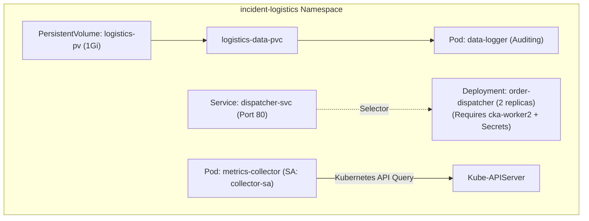

# Side Quest 01 — Incident Alpha: The Broken Logistics Pipeline

**Difficulty:** Hard / CKA Level  
**Target Namespace:** `incident-logistics`  
**Dedicated Worker Node:** `cka-worker2` (`tier=worker-processing`, Taint: `workload=logistics:NoSchedule`)  

---

## 🚨 Incident Brief (SEV-1 Alert)

At 02:15 UTC, automated alerts triggered across the production logistics cluster. The entire logistics sync pipeline deployed in the `incident-logistics` namespace has suffered a multi-tier outage:
- Pods are failing to schedule or stuck in `Pending`.
- API components are crash-looping or failing configuration loading.
- Internal service discovery has lost all backend endpoints.
- Observability and metrics collection pods are throwing critical authorization errors.

You are the on-call Site Reliability Engineer. The incident commander has tasked you with investigating the cluster, diagnosing the root causes across all components, and bringing all systems back to a **100% healthy, green state**.

---

## 📋 Architecture Overview

The pipeline consists of four components in namespace `incident-logistics`:



---

## 🎯 Mission Objectives

### Objective 1: Unblock Persistent Storage (`data-logger`)
- **Symptom:** `kubectl get pod data-logger -n incident-logistics` is stuck in `Pending`.
- **Tasks:**
  1. Inspect the Pod events and discover why volume scheduling has halted.
  2. Inspect the pre-provisioned PersistentVolume `logistics-pv` and the claim `logistics-data-pvc`.
  3. Fix the PersistentVolumeClaim configuration so it successfully binds to `logistics-pv` (do not delete or recreate the PV).
  4. Ensure `data-logger` transitions to `1/1 Running`.

---

### Objective 2: Resolve Scheduling, Secrets & Probes (`order-dispatcher`)
- **Symptom:** The `order-dispatcher` Deployment (2 replicas) is completely offline.
- **Tasks:**
  1. **Scheduling Constraints:** Inspect why pods cannot schedule on `cka-worker2`. Check the node labels and taints on `cka-worker2` against the deployment's `nodeSelector` and `tolerations`. Fix any typos.
  2. **Secret Configuration:** Once scheduled, investigate why the pods fail container creation (`CreateContainerConfigError`). Inspect secret `api-secrets` and correct the environment variable key reference.
  3. **Liveness Probe:** Fix the liveness probe configuration (path and port) so the application does not trigger probe failures.
  4. Ensure all 2 replicas (`2/2`) are `Running` and `Ready` on `cka-worker2`.

---

### Objective 3: Fix Service Discovery & Endpoints (`dispatcher-svc`)
- **Symptom:** Internal microservices cannot connect to `http://dispatcher-svc.incident-logistics.svc.cluster.local`.
- **Tasks:**
  1. Inspect the Service `dispatcher-svc` and its endpoints (`kubectl get ep dispatcher-svc -n incident-logistics`).
  2. Identify why no Pod endpoints are registered behind the service.
  3. Correct the service selector so that traffic properly routes to the `order-dispatcher` pods.

---

### Objective 4: Grant Least-Privilege RBAC (`metrics-collector`)
- **Symptom:** The `metrics-collector` Pod is crashing (`CrashLoopBackOff` / `Error`).
- **Logs:** Pod logs report `CRITICAL RBAC ERROR: Kubernetes API returned HTTP 403` when trying to query `/api/v1/namespaces/incident-logistics/pods`.
- **Tasks:**
  1. Identify the `ServiceAccount` used by the pod (`collector-sa`).
  2. Create a `Role` named `collector-role` in namespace `incident-logistics` that permits `get`, `list`, and `watch` on `pods` and `services`.
  3. Create a `RoleBinding` named `collector-rolebinding` in namespace `incident-logistics` binding `collector-sa` to `collector-role`.
  4. Ensure `metrics-collector` restarts and stays in `1/1 Running` state.

---

## 🛠 Verification & Grading

A real-time scoring and validation script is ready in this directory.

To check your progress at any time, run:
```bash
./advanced-exercises/sidequests/sidequest-01-logistics-outage/verify.sh
```

When all 4 objectives are resolved, the script will output:
```text
TOTAL SCORE: 100 / 100 - EXCELLENT WORK! ALL SYSTEMS GREEN!
```

---

<details>
<summary>💡 Need a Hint? (Click to expand)</summary>

1. **Storage:** Run `kubectl describe pvc logistics-data-pvc -n incident-logistics` and `kubectl describe pv logistics-pv`. Compare `storageClassName` and capacity requests (`storage: 1Gi` vs `storage: 2Gi`).
2. **Scheduling:** Check node labels/taints with `kubectl get node cka-worker2 --show-labels` and `kubectl describe node cka-worker2 | grep -i taints`. Look closely at `tier=worker-processing` vs `tier: worker-processor`, and `workload=logistics` vs `workload=logistic`.
3. **Secrets:** Run `kubectl get secret api-secrets -n incident-logistics -o yaml`. Notice the key is `AUTH_TOKEN`, not `DB_AUTH_TOKEN`.
4. **Probes:** Nginx alpine listens on containerPort `80` and serves `/` by default.
5. **Endpoints:** Compare `.spec.template.metadata.labels` in `order-dispatcher` with `.spec.selector` in `dispatcher-svc`.
6. **RBAC:** Use `kubectl create role collector-role --verb=get,list,watch --resource=pods,services -n incident-logistics` and `kubectl create rolebinding collector-rolebinding --role=collector-role --serviceaccount=incident-logistics:collector-sa -n incident-logistics`.

</details>

---

<details>
<summary>📖 Solution Reference (Click to expand after solving)</summary>

### 1. Fix Storage (PVC)
Delete the mismatched PVC and re-apply with matching parameters:
```yaml
apiVersion: v1
kind: PersistentVolumeClaim
metadata:
  name: logistics-data-pvc
  namespace: incident-logistics
spec:
  storageClassName: local-storage
  accessModes:
    - ReadWriteOnce
  resources:
    requests:
      storage: 1Gi
```
```bash
kubectl delete pvc logistics-data-pvc -n incident-logistics --force --grace-period=0
kubectl apply -f <fixed-pvc.yaml>
kubectl delete pod data-logger -n incident-logistics # to trigger immediate re-bind
```

### 2. Fix Deployment (`order-dispatcher`)
Edit the deployment:
- `nodeSelector`: `tier: worker-processing`
- `tolerations`: `value: logistics`
- `env.valueFrom.secretKeyRef.key`: `AUTH_TOKEN`
- `livenessProbe`: `path: /`, `port: 80`

### 3. Fix Service Selector (`dispatcher-svc`)
```bash
kubectl patch service dispatcher-svc -n incident-logistics -p '{"spec":{"selector":{"app":"order-dispatcher","tier":"api"}}}'
```

### 4. Create RBAC for `metrics-collector`
```bash
kubectl create role collector-role -n incident-logistics --verb=get,list,watch --resource=pods,services
kubectl create rolebinding collector-rolebinding -n incident-logistics --role=collector-role --serviceaccount=incident-logistics:collector-sa
kubectl delete pod metrics-collector -n incident-logistics
```
</details>
